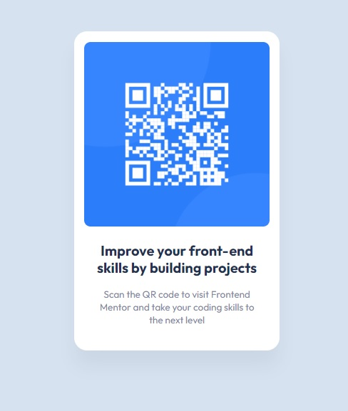

# Frontend Mentor - QR code component solution

This is a solution to the [QR code component challenge on Frontend Mentor](https://www.frontendmentor.io/challenges/qr-code-component-iux_sIO_H). Frontend Mentor challenges help you improve your coding skills by building realistic projects. 

## Table of contents

- [Overview](#overview)
  - [Screenshot](#screenshot)
  - [Links](#links)
- [My process](#my-process)
  - [Built with](#built-with)
  - [What I learned](#what-i-learned)
  - [Continued development](#continued-development)
  - [Useful resources](#useful-resources)
- [Author](#author)
- [Acknowledgments](#acknowledgments)

**Note: Delete this note and update the table of contents based on what sections you keep.**

## Overview

  ### Screenshot
  

  ### Links
  - Solution URL: [Add solution URL here](https://www.frontendmentor.io/solutions/my-solution-on-a-qr-code-component-UaZ9HJ5mlB)
  - Live Site URL: [Add live site URL here](https://adorable-beijinho-5d6edf.netlify.app/)

## My process
I used figma to get the extra information that i needed and then i coded it in VSCode.
I started by writing the HTML and then i wrote the CSS while checking my progress in a live-server. 

  ### Built with
  - Semantic HTML5 markup
  - CSS custom properties
  - Flexbox

  ### What I learned
  I have grown a little more confident in using flexbox.

  ### Continued development
  I will continue to put focus on layouts in flex and grid.

  ### Useful resources
  MDN

## Author
- Website - [Jon Henrik Åvitsland](#)
- Frontend Mentor - [@jonhenrikaavitsland](https://www.frontendmentor.io/profile/jonhenrikaavitsland)
- Github - [@jonhenrikaavitsland](https://github.com/jonhenrikaavitsland)

## Acknowledgments
Shoutout to Kevin Powell who tipped me of Frontend Mentor! (https://www.youtube.com/@KevinPowell)
