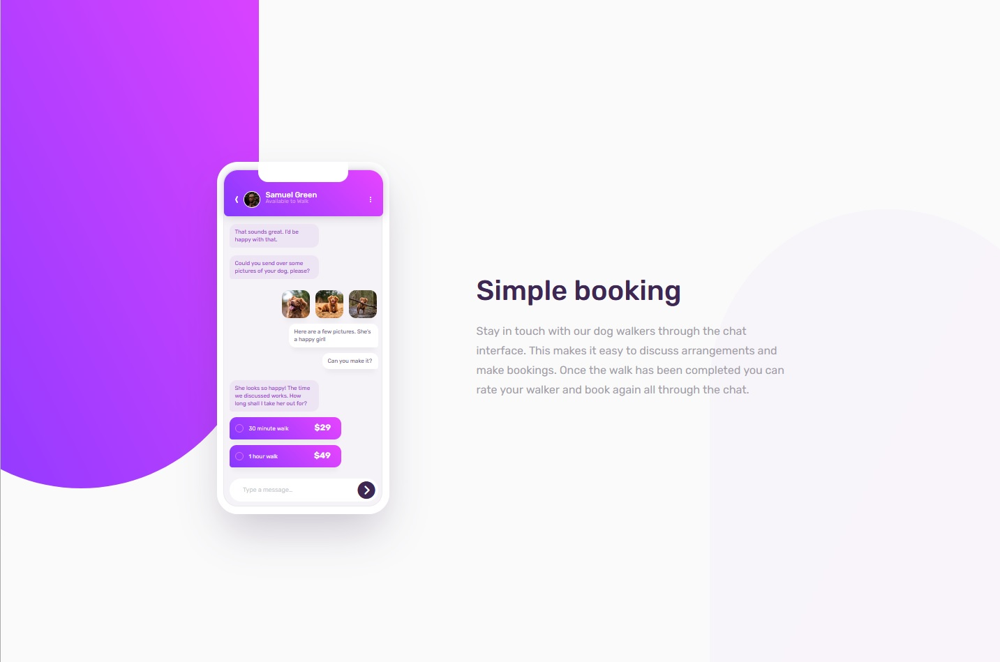

# Frontend Mentor - Chat app CSS illustration solution

This is a solution to the [Chat app CSS illustration challenge on Frontend Mentor](https://www.frontendmentor.io/challenges/chat-app-css-illustration-O5auMkFqY). Frontend Mentor challenges help you improve your coding skills by building realistic projects. 

## Table of contents

- [Overview](#overview)
  - [The challenge](#the-challenge)
  - [Screenshot](#screenshot)
  - [Links](#links)
- [My process](#my-process)
  - [Built with](#built-with)
  - [What I learned](#what-i-learned)
- [Author](#author)

## Overview

### The challenge

Users should be able to:

- View the optimal layout for the component depending on their device's screen size

### Screenshot

### Links

- Solution URL: [https://github.com/jonhenrikaavitsland/frontend-mentor-portofolio/tree/main/app]
- Live Site URL: [https://my-frontend-mentor-portfolio.netlify.app/app/app-illustration]

## My process

### Built with

- Semantic HTML5 markup
- CSS custom properties
- Flexbox
- Mobile-first workflow

### What I learned

Doing this challenged helped me getting back into css before upcoming school exam as I have been a bit lazy during the summer holiday. It was a good challenge that I really enjoyed. 

## Author

- Website - [Jon Henrik Åvitsland](https://my-frontend-mentor-portfolio.netlify.app/)
- Frontend Mentor - [@jonhenrikaavitsland](https://www.frontendmentor.io/profile/jonhenrikaavitsland)

