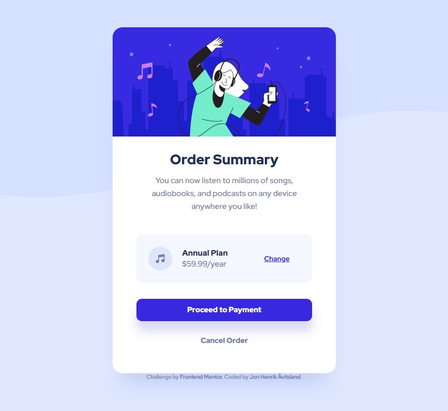

# Frontend Mentor - Order summary card solution

This is a solution to the [Order summary card challenge on Frontend Mentor](https://www.frontendmentor.io/challenges/order-summary-component-QlPmajDUj). Frontend Mentor challenges help you improve your coding skills by building realistic projects. 

## Table of contents

- [Overview](#overview)
  - [The challenge](#the-challenge)
  - [Screenshot](#screenshot)
  - [Links](#links)
- [My process](#my-process)
  - [Built with](#built-with)
  - [What I learned](#what-i-learned)
- [Author](#author)

## Overview

### The challenge

Users should be able to:

- See hover states for interactive elements

### Screenshot

### Links

- Solution URL: [https://github.com/jonhenrikaavitsland/order-summary-component]
- Live Site URL: [https://ubiquitous-croquembouche-5c229a.netlify.app/]

## My process

### Built with

- Semantic HTML5 markup
- CSS custom properties
- Flexbox
- Mobile-first workflow

### What I learned

I learned more about using flex-box and background images.

## Author

- Website - [Jon Henrik Åvitsland](#)
- Frontend Mentor - [@jonhenrikaavitsland](https://www.frontendmentor.io/profile/jonhenrikaavitsland)
