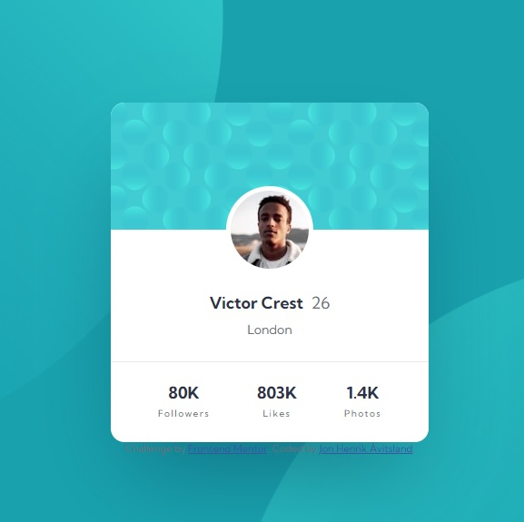

# Frontend Mentor - Profile card component solution

This is a solution to the [Profile card component challenge on Frontend Mentor](https://www.frontendmentor.io/challenges/profile-card-component-cfArpWshJ). Frontend Mentor challenges help you improve your coding skills by building realistic projects. 

## Table of contents

- [Overview](#overview)
  - [The challenge](#the-challenge)
  - [Screenshot](#screenshot)
  - [Links](#links)
- [My process](#my-process)
  - [Built with](#built-with)
  - [What I learned](#what-i-learned)
- [Author](#author)
- [Acknowledgments](#acknowledgments)

## Overview

### The challenge

- Build out the project to the designs provided

### Screenshot

### Links

- Solution URL: [https://github.com/jonhenrikaavitsland/profile-card-component]
- Live Site URL: [https://effervescent-horse-7c569b.netlify.app/]

## My process

### Built with

- Semantic HTML5 markup
- CSS custom properties
- Flexbox
- CSS Grid
- Mobile-first workflow

### What I learned

I learned how to position background images and grown more confident in using flex-box and grid.

## Author

- Website - [Jon Henrik Åvitsland](#)
- Frontend Mentor - [@jonhenrikaavitsland](https://www.frontendmentor.io/profile/jonhenrikaavitsland)

## Acknowledgments

I came across a helpful answer from @itush on (https://www.frontendmentor.io) that put me on the right track in positioning the background top and bottom files on the body element. 
